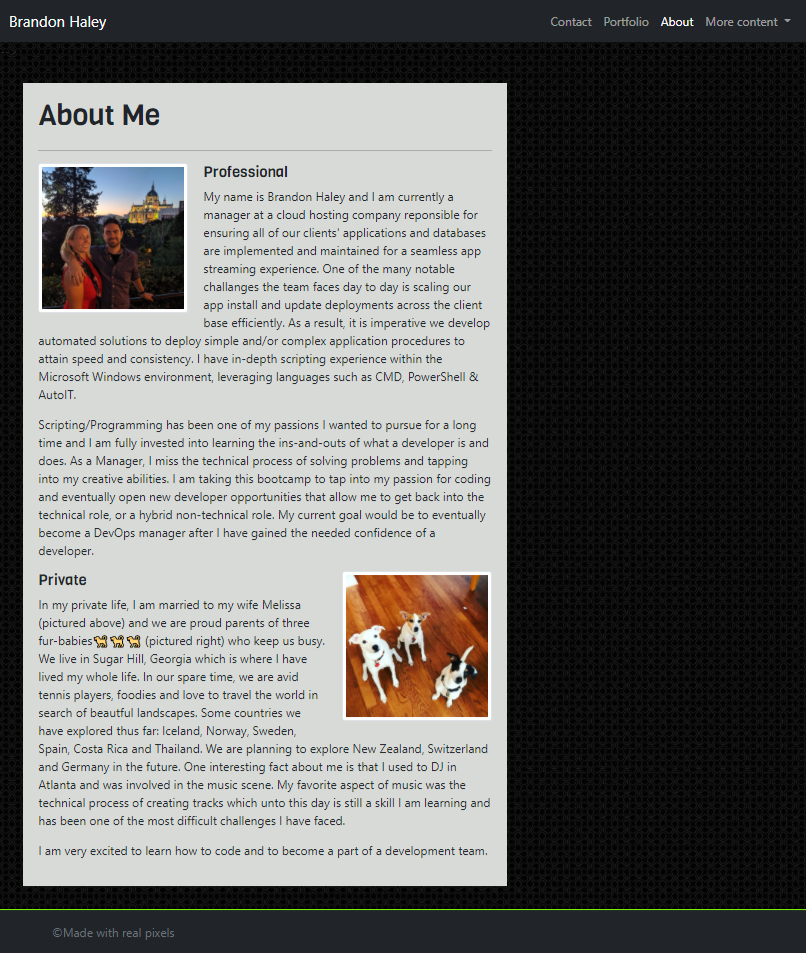
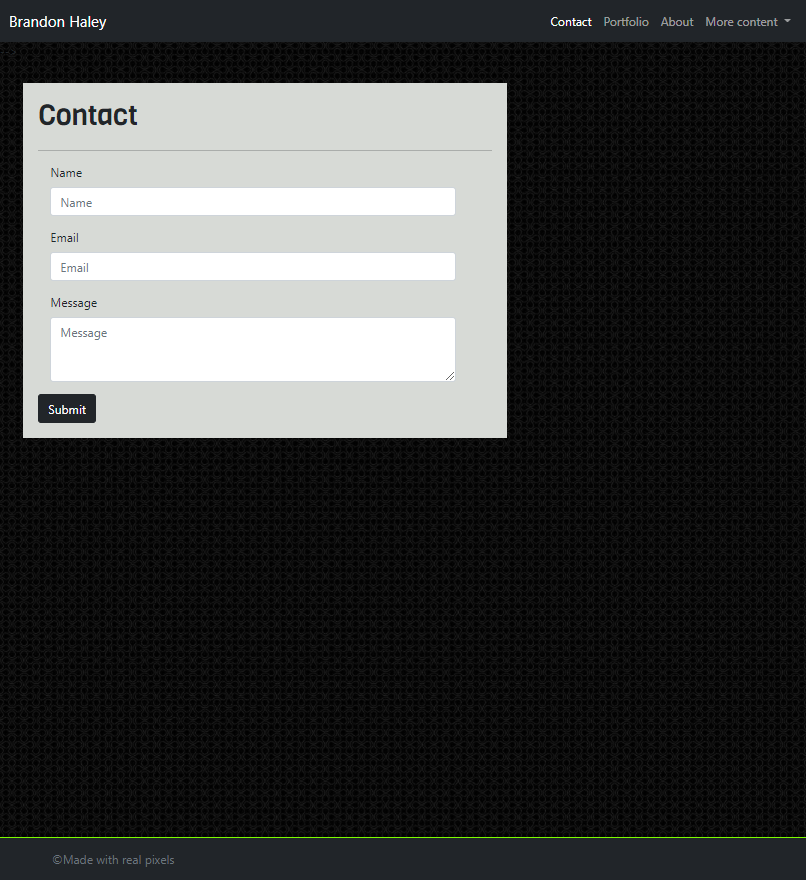
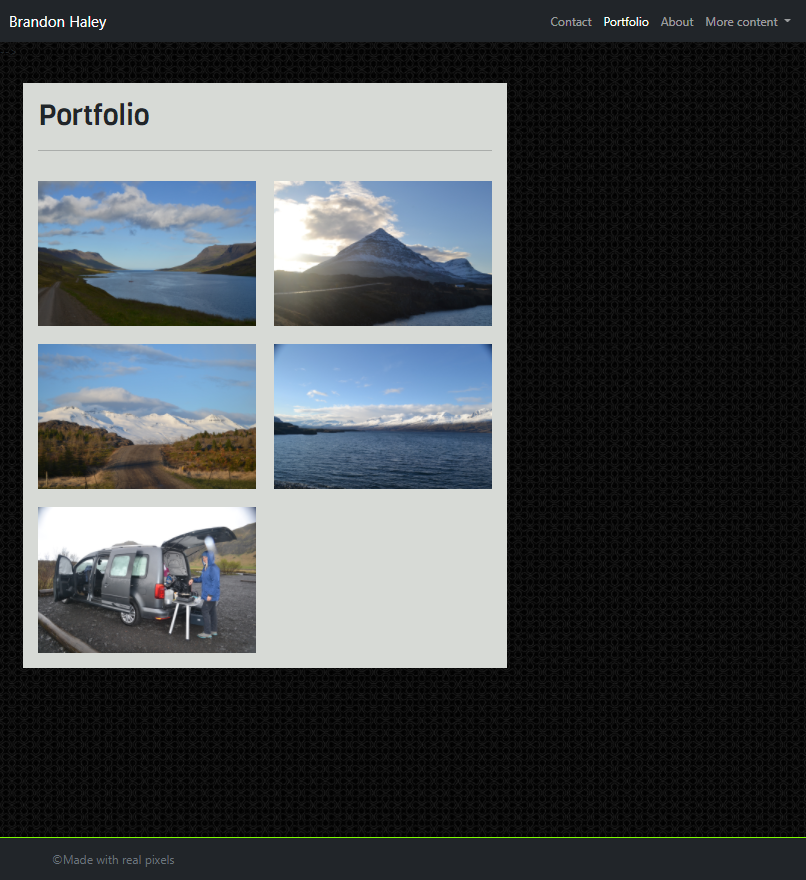

# Portfolio - Brandon Haley

## General 📖
---
- Date:           12/19/2020
- Refactored by:  Brandon Haley
- Email:          Kyle7286@gmail.com
- Github:         https://github.com/Kyle7286/responsive-portfolio/
- Website:        https://kyle7286.github.io/responsive-portfolio/

## About/Purpose ❔
---
This website is to become my personal showcase / portfolio.  Currently, it contains 3 pages (Contact, Portfolio, About), which will contain more content as time goes on.  Eventually, the page will also contain links to my other pages I create outside the portfolio.  You will find some information about me, a collection of pictures from my Iceland trip and a contact page which currently does not function... for now.

## Takeaways 🥡
--- 
* Learned how to implement bootstrap content

* Learned how to manipulate bootstrap content with various sizing, positioning and coloring parameters; this was difficult at first but after many hours of fiddling and watching tutorials, I now understand how the system was intended to be used; very powerful

* Figured out what "mobile first" means in terms of website building with bootstrap; meaning that the content needs to be told what to do when the page is getting larger rather than getting smaller

* Found a quick and easy way to configure column content and limit rows with "row-cols-lg-2" and also configure gutters

* Learned that it would be better to create all global content on a single page first before proceeding with creating the same content on another page to prevent retrofitting your fixes/changes you discover as time goes on.  
    * Essentially, focus on 1 page at a time and get it as perfect as you can, then copy it to your other pages

* Learned how to not relay on media queries while leveraging bootstrap
    * Also learned how to use media queries for some situations

## Screenshots 📊
---

## Thank you 👍 
---
Thank you for your time reviewing my project/code! 
I offer you a relaxing scenery from my Iceland trip - Enjoy!

Skógafoss, South Iceland

